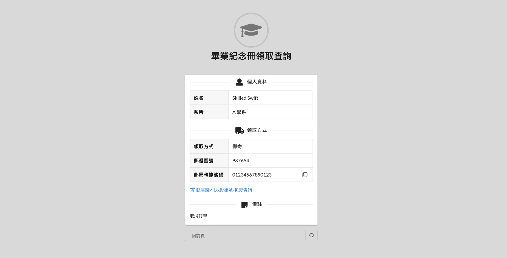

# ntuoc14-query-sheet

Querying spreadsheet web app for National Taiwan University Orientation Camp.



## Quickstart

```bash
$ sudo apt install sqlite3
$ make debug
$ firefox http://127.0.0.1:5000
```

`server/app/instance/sheet.csv` stores the form responses. It requires sqlite3
to import the spreadsheet into `app/db.sqlite`.

## Credits

- [Flask](https://flask.palletsprojects.com/) - the Python micro framework for building web applications.
- [SQLite](https://www.sqlite.com/index.html) - C-language library that implements a small, fast, self-contained, high-reliability, full-featured, SQL database engine.
